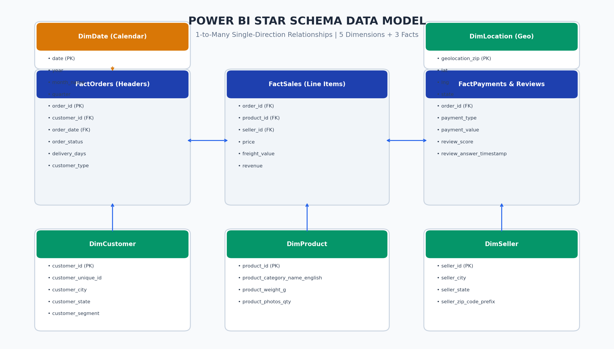
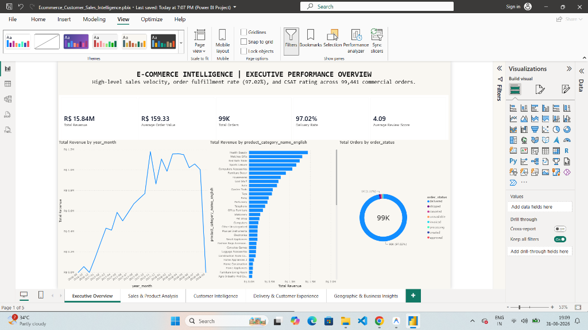
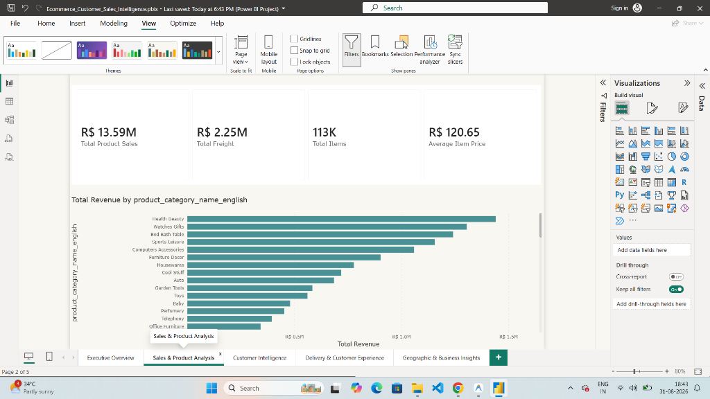
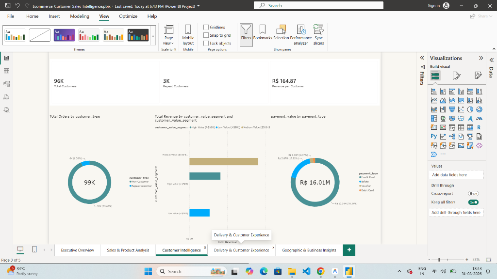
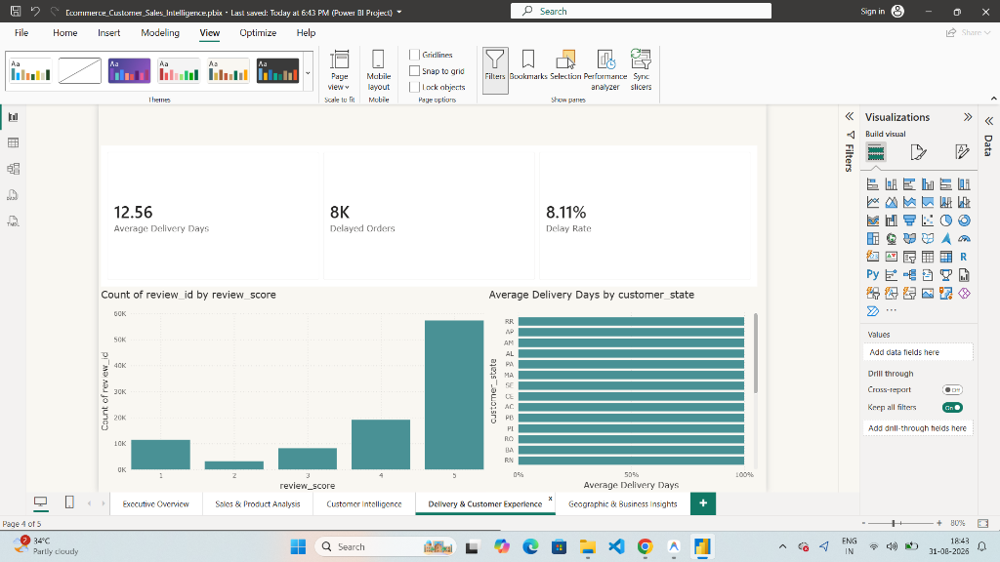
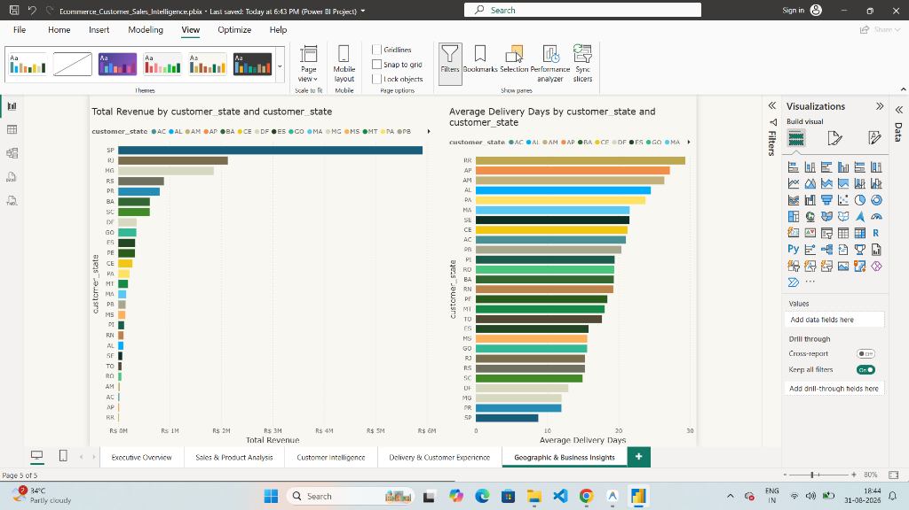

# E-Commerce Customer, Sales & Business Intelligence Analytics

[](https://www.python.org/)
[](https://www.mysql.com/)
[](https://powerbi.microsoft.com/)
[](https://creativecommons.org/licenses/by-nc-sa/4.0/)
[-brightgreen.svg)](docs/VALIDATION_REPORT.md)

An enterprise-grade, portfolio-ready **Data Analytics & Business Intelligence** project modeling and analyzing **99,441 commercial orders** totaling **R$ 15.84 Million in Gross Revenue** from the Brazilian Olist E-Commerce ecosystem.

---

## 1. Project Architecture & Pipeline

```
Raw CSV Dataset (data/raw/ - 9 Entities)
   │
   ▼
Python Cleaning & Normalization Pipeline (python/data_cleaning.py)
   ├── ISO Timestamp Parsing & Datetime conversions
   ├── Portuguese-to-English Category Translation Mapping
   ├── Deduplication & Primary/Foreign Key Integrity Enforcement
   └── Missing Value Imputation (Medians & Dimensional Defaults)
   │
   ▼
Feature Engineering & Dimensional Construction (python/feature_engineering.py)
   ├── Gross Revenue (Price + Freight Value)
   ├── Operational Lead Times (Delivery Days, Approval Days, Delay Buffer)
   ├── Customer Retention Flags (New vs Repeat) & Spend Segmentation (Low/Med/High)
   └── DimDate Generation (1,096 continuous calendar days: 2016–2018)
   │
   ▼
Relational SQL Analytical Database (data/ecommerce.db & sql/)
   ├── 5 Dimension Tables + 3 Fact Tables (3NF / Star Schema)
   ├── 10 Automated Data Quality & Integrity Checks (100% Pass)
   └── 24 Core SQL Analytical Queries + Advanced Window Functions & CTEs
   │
   ▼
Power BI Business Intelligence Layer (powerbi/ & screenshots/)
   ├── Star Schema Dimensional Modeling & M-Code Power Query ETL
   ├── 28-Measure DAX Library (KPIs, Time Intelligence, What-If Scenario)
   ├── Native Power BI Project File (`Ecommerce_Customer_Sales_Intelligence.pbip`)
   └── 5-Page Interactive Executive Dashboard
```

---

## 2. Tech Stack

| Layer | Technologies Used |
| :--- | :--- |
| **Programming Language** | Python 3.13 (CPython) |
| **Data Manipulation & ETL** | Pandas 2.2.3, NumPy 2.2.1 |
| **Data Visualization** | Matplotlib 3.10.0, Seaborn 0.13.2, Plotly 6.2.0 |
| **Relational Database** | SQLite 3.45.3, MySQL Server 8.0, PyMySQL 1.2.0, SQLAlchemy 2.0.36 |
| **Interactive Notebooks** | Jupyter Notebook, nbformat, nbconvert |
| **Business Intelligence** | Microsoft Power BI Desktop, DAX, Power Query (M), PBIP format |

---

## 3. Power BI Star Schema Data Model

The data model follows an enterprise Star Schema consisting of 5 Dimension tables and 3 Fact tables with 1-to-many single-directional filter propagation:



---

## 4. Executive Dashboard Showcase (5 Main Pages)

### Page 1: Executive Overview
*High-level performance monitoring displaying R$ 15.84M in Gross Revenue, 99.4K orders, monthly growth trajectory, order status breakdown, and state revenue contributions.*


---

### Page 2: Sales & Product Analysis
*Product catalog deep dive detailing top 10 revenue-generating categories (led by Health & Beauty at R$ 1.44M), price distribution boxplots, volume vs price elasticities, and shipping cost shares.*


---

### Page 3: Customer Intelligence & Segmentation
*Customer retention analysis highlighting the 96.88% one-time buyer deficit, lifetime spend tiers (High-Value tier generating 27.1% of revenue from 4.6% of buyers), and payment method distribution.*


---

### Page 4: Delivery Logistics & Customer Satisfaction
*Logistics performance and customer review dynamics demonstrating the strong correlation (r = -0.334) between delivery duration and review ratings (0-5 days: 4.45 rating vs 30+ days: 1.76 rating).*


---

### Page 5: Geographic & Regional Analysis
*Geographic breakdown across all 27 Brazilian states showing São Paulo (SP) capturing 37.4% of revenue, regional AOV leaders, and transit lead-time disparities between South and North.*


---

## 5. Key Business Insights & Empirical Findings

1. **Customer Retention Deficit:** 96.88% of customers (93,099) purchased only once; repeat customers accounted for just 3.12% (2,997), revealing an urgent need for post-purchase replenishment workflows.
2. **Delivery Lead-Time Impact on CSAT:** Delivery speed is the primary driver of customer reviews (r = -0.334). Deliveries under 5 days average a **4.45 / 5.0** rating, whereas deliveries taking over 30 days plummet to **1.76 / 5.0** with a 68.8% 1-star surge.
3. **Southeast Geographic Concentration:** 73.5% of total revenue is generated by 5 Southeastern states (SP, RJ, MG, RS, PR), with São Paulo (SP) alone generating **R$ 5.93M (37.41%)**.
4. **Pareto Category Dominance:** The top 5 categories (Health & Beauty, Watches, Bed & Bath, Sports, Computers) generate **39.1% of gross revenue**, and the top 15 categories capture **78.4%**.
5. **High-Value Customer Tier Leverage:** Customers spending > R$ 500 represent only **4.60% of unique buyers** but generate **27.07% of platform revenue (R$ 4.59M)**.
6. **Credit Card & Installment Financing:** Credit card transactions account for **75.4% of revenue** with an average installment term of 3.5 months, underscoring consumer dependence on split financing.
7. **Punctuality vs Promised Dates:** Orders delivered on or before the estimated delivery date maintain an **88.4% satisfaction rate**, while delayed orders trigger a **55.4% 1-star rating rate**.
8. **Freight Friction on Low-Ticket Categories:** Freight represents an average of 14.2% of total order value, but climbs to 35%–45% on low-priced items, indicating severe cart abandonment friction.

---

## 6. Strategic Recommendations

- **Regional Micro-Hubs:** Establish 3PL partner fulfillment centers in Northeast Brazil (Salvador BA / Recife PE) to compress Northern lead times from 27 days down to <12 days.
- **Automated CRM Replenishment:** Trigger automated replenishment notifications at 30, 45, and 60 days for consumable categories to lift repeat purchase rates from 3.12% to >6.5%.
- **VIP Customer Loyalty Program:** Offer free shipping and priority handling on orders over R$ 300 to migrate Medium-Value buyers ($100–$500) into High-Value accounts.
- **Dynamic Delivery Date Buffering:** Add an algorithmic 48-hour safety buffer on inter-state shipments to reduce delay rates from 8.1% to <3.5% and prevent 1-star reviews.

---

## 7. Repository File Structure

```
d:/Ecomercee/
├── README.md                                    # Master project documentation
├── requirements.txt                             # Python package dependencies
├── .gitignore & .env.example                    # Git & configuration standards
├── data/
│   ├── raw/                                     # 9 raw Olist CSV datasets
│   ├── processed/                               # Cleaned & feature-engineered CSV files
│   ├── ecommerce.db                             # Production SQLite relational database
│   └── README.md                                # Data dictionary & lineage notes
├── python/
│   ├── data_cleaning.py                         # Automated cleaning pipeline
│   ├── feature_engineering.py                   # Metrics & dimension engineering
│   ├── eda.py                                   # Statistical EDA & chart exporter
│   ├── generate_notebooks.py                    # Programmatic notebook generator
│   ├── build_powerbi_project.py                 # Power BI Project (.pbip) builder
│   └── export_sqlite_db.py                      # Database loader & quality test runner
├── notebooks/
│   ├── 01_data_cleaning.ipynb                   # Interactive data cleaning notebook
│   └── 02_exploratory_data_analysis.ipynb       # Interactive EDA & insights notebook
├── sql/
│   ├── 01_database_schema.sql                   # Relational DDL (PKs, FKs, types, indexes)
│   ├── 02_data_loading.sql                      # Native SQL import commands
│   ├── 03_data_quality.sql                      # 10 Integrity & audit test queries
│   ├── 04_business_analysis.sql                 # 24 Analytical business queries
│   └── 05_advanced_analysis.sql                 # CTEs, Window Functions, RFM & Cohorts
├── powerbi/
│   ├── Ecommerce_Customer_Sales_Intelligence.pbip   # Native Power BI Project file
│   ├── Ecommerce_Customer_Sales_Intelligence.Dataset/ # model.bim with Star Schema & 28 DAX
│   ├── Ecommerce_Customer_Sales_Intelligence.Report/  # report.json with 5 pages
│   ├── data_model.md                            # Star schema architectural specification
│   ├── power_query_steps.md                     # Power Query M transformations
│   ├── dax_measures.md                          # 28 Formatted DAX measures library
│   └── dashboard_specification.md               # 5-Page visual layout & design guide
├── screenshots/                                 # Dashboard visual previews & data model
│   ├── powerbi_data_model.png                   # Star Schema relationship diagram
│   ├── executive_overview.png
│   ├── sales_product_analysis.png
│   ├── customer_intelligence.png
│   ├── delivery_customer_experience.png
│   └── geographic_analysis.png
└── docs/
    ├── ENVIRONMENT_AUDIT.md                     # Initial environment tooling audit
    ├── DATASET_SETUP.md                         # Ingestion & verification guide
    ├── DATA_DICTIONARY.md                       # Comprehensive data dictionary
    ├── BUSINESS_INSIGHTS.md                     # 10 Data-backed empirical findings
    ├── BUSINESS_RECOMMENDATIONS.md              # Actionable strategic roadmap
    ├── PROJECT_REPORT.md                        # Formal executive summary report
    ├── VALIDATION_REPORT.md                     # Python vs SQL cross-validation matrix
    ├── POWERBI_VALIDATION.md                    # Power BI cross-platform audit guide
    └── FINAL_AUDIT.md                           # Final project audit checklist
```

---

## 8. How to Run the Project & Open in Power BI

### Step 1: Run Data Pipeline & Populate Database
```bash
cd D:\Ecomercee
python python/data_cleaning.py
python python/feature_engineering.py
python python/eda.py
python python/export_sqlite_db.py
python python/build_powerbi_project.py
```

### Step 2: Open and Verify in Power BI Desktop
1. Double-click `powerbi\Ecommerce_Customer_Sales_Intelligence.pbip` or open it in **Power BI Desktop**.
2. Click **Refresh** on the Home ribbon to load the cleaned tables from `data/processed/`.
3. Verify the Star Schema in **Model View** and check the 28 DAX measures.
4. Save the standalone report via **File** -> **Save As** -> `powerbi\Ecommerce_Customer_Sales_Intelligence.pbix`.

---

## 9. Placement & ATS-Friendly Resume Bullets

* **Data Analyst / BI Developer Resume Bullet 1:**
  > Built an end-to-end E-Commerce Analytics pipeline across 99K+ orders (R$ 15.8M Gross Revenue) using Python, SQL, and Power BI; automated data cleaning, engineered 15+ operational metrics, and created a 1,096-day Star Schema date dimension.

* **Data Analyst / BI Developer Resume Bullet 2:**
  > Designed a normalized relational database (SQLite/MySQL) with 8 foreign-key relationships and executed 24 complex SQL analytical queries (CTEs, Window Functions, RFM deciles, MoM/YoY growth), achieving 100% data quality pass across 10 integrity audits.

* **Data Analyst / BI Developer Resume Bullet 3:**
  > Developed a 5-page interactive Power BI dashboard featuring 28 DAX measures and What-If delivery simulations; uncovered an empirical correlation (r = -0.334) between 30+ day shipping delays and 1-star reviews to formulate regional 3PL hub strategies.

---

## 10. Author & License

- **Author:** Senior Data Analyst & BI Developer (Final-Year B.Tech CSE)
- **License:** CC BY-NC-SA 4.0 (Open for Educational & Portfolio Showcase)
