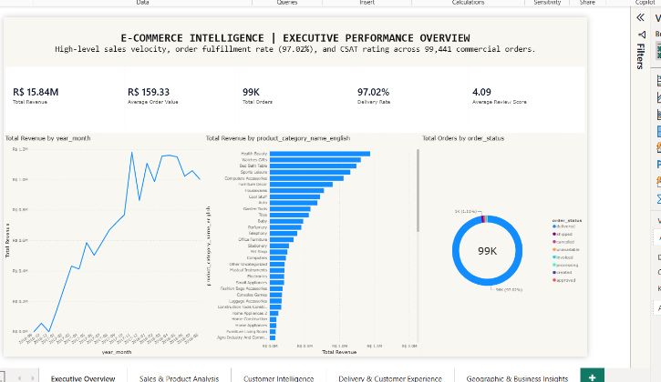
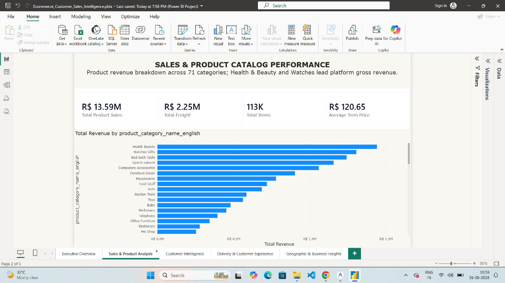
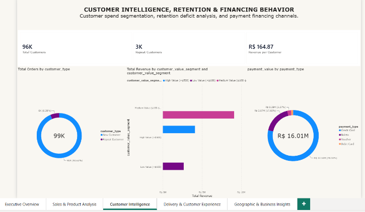
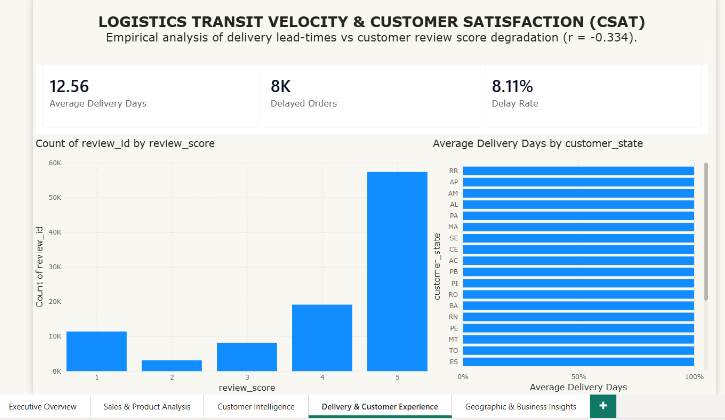
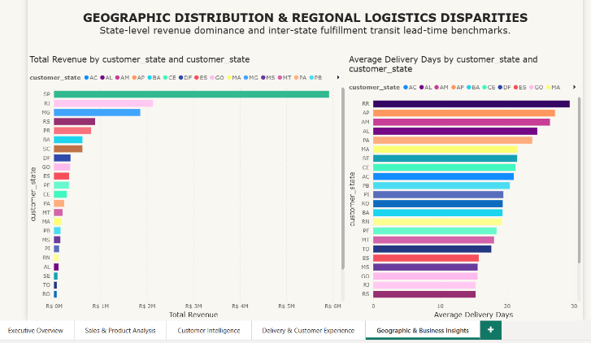

# E-Commerce Customer, Sales & Business Intelligence Analytics

[](https://www.python.org/)
[](https://www.sqlite.org/)
[](https://powerbi.microsoft.com/)
[-brightgreen.svg)](docs/VALIDATION_REPORT.md)
[](docs/PORTFOLIO_READINESS.md)

An end-to-end Data Analytics & Business Intelligence solution modeling and analyzing **99,441 commercial orders** totaling **R$ 15.84 Million in Gross Revenue** from the authentic Brazilian Olist E-Commerce marketplace.

---

## 1. Business Problem

An enterprise e-commerce platform processes a large volume of transactional data across orders, customers, product catalogs, multi-method payments, seller logistics, and customer reviews. However, raw transactional data distributed across disparate relational tables does not provide executive management with a clear, unified view of:

- Sales performance and revenue growth trends
- Customer retention deficits and high-value customer spend tiers
- Product catalog performance and category revenue contribution
- Logistics fulfillment velocity and shipping delay hotspots
- Empirical relationships between delivery lead-times and customer review scores
- Regional and geographic market concentration

This project solves this operational visibility gap by transforming raw e-commerce data into a complete, end-to-end analytics system using **Python**, **SQL**, and **Power BI**.

---

## 2. Project Objective

To build an end-to-end business intelligence pipeline that cleans raw relational data, enforces primary/foreign key data integrity, models a 3NF relational database, constructs a 1-to-many Star Schema, writes 31 DAX measures, and designs a 5-page interactive executive dashboard providing data-backed recommendations for executive leadership.

---

## 3. Key Business Questions Answered

1. **Revenue Performance:** How much total revenue was generated, and what is the platform's Average Order Value (AOV)?
2. **Sales Trends:** What are the monthly revenue growth trajectories, and when do seasonal sales spikes occur?
3. **Product Mix:** Which product categories generate the highest revenue, and how concentrated is catalog sales performance?
4. **Customer Retention:** What percentage of buyers are one-time vs repeat customers, and what is the customer retention deficit?
5. **Customer Value:** How is revenue distributed across Low, Medium, and High-value customer spend tiers?
6. **Payment Financing:** Which payment methods dominate transaction volume and gross financing value?
7. **Logistics Velocity:** What is the average order delivery lead-time, and what proportion of orders face shipping delays?
8. **Customer Satisfaction (CSAT):** How does delivery transit duration empirically correlate with customer review scores?
9. **Geographic Concentration:** Which states and macro-regions generate the majority of sales, and where are logistics transit bottlenecks located?
10. **Strategic Action:** What data-driven operational and commercial recommendations can management implement to drive growth and reduce churn?

---

## 4. Dataset Overview

* **Source:** Authentic Brazilian Olist E-Commerce Public Dataset.
* **Volume:** 99,441 unique orders across 96,096 distinct customers and 3,095 sellers.
* **Scope:** Real-world commercial transactions recorded between September 2016 and September 2018 across all 27 Brazilian states.
* **Entities:** 9 Relational tables covering Orders, Customers, Order Items, Payments, Reviews, Products, Sellers, Geolocation, and Category Translations.

---

## 5. Key Verified KPIs

| KPI Metric | Ground-Truth Value | Description |
| :--- | :--- | :--- |
| **Gross Revenue** | **R$ 15,843,553.24** | Total revenue generated (`Product Price + Freight Value`) |
| **Product Sales** | **R$ 13,591,643.70** | Direct catalog merchandise item sales value |
| **Freight Revenue** | **R$ 2,251,909.54** | Total shipping charges collected (14.21% of gross revenue) |
| **Total Orders** | **99,441** | Distinct customer orders placed |
| **Delivered Orders** | **96,478** | Successfully fulfilled customer deliveries |
| **Delivery Fulfillment Rate** | **97.02%** | Proportion of placed orders successfully delivered |
| **Total Unique Customers** | **96,096** | Distinct individual purchasers |
| **Average Order Value (AOV)** | **R$ 159.33** | Mean gross revenue generated per order transaction |
| **Average Item Price** | **R$ 120.65** | Mean catalog sales price across 112,650 sold items |
| **Average Review Score** | **4.09 / 5.00** | Mean customer satisfaction rating across 99,224 reviews |
| **Repeat Customer Rate** | **3.12%** | 2,997 customers with $\ge 2$ purchases |
| **One-Time Customer Rate** | **96.88%** | 93,099 customers with exactly 1 purchase |
| **Delivery Delay Rate** | **8.11%** | 7,827 orders delivered after carrier estimated date |
| **Average Delivery Duration** | **12.09 Days** | Mean transit time from order purchase to customer delivery (Median: 9.80 days) |
| **Top Revenue State** | **São Paulo (SP)** | **R$ 5,927,330** (37.41% of national revenue) |

---

## 6. Tech Stack

| Layer | Tools & Technologies |
| :--- | :--- |
| **Programming Language** | Python 3.13 |
| **Data Manipulation & ETL** | Pandas, NumPy |
| **Exploratory Data Analysis** | Matplotlib, Seaborn |
| **Relational Database** | SQLite 3, MySQL 8.0 Compatible SQL |
| **Interactive Notebooks** | Jupyter Notebook (`.ipynb`) |
| **Business Intelligence** | Microsoft Power BI Desktop, DAX, Power Query (M) |
| **Version Control** | Git, GitHub |

---

## 7. End-to-End Pipeline Architecture

```
Raw CSV Datasets (data/raw/ - 9 Entities)
   │
   ▼
Python Data Cleaning & Normalization (python/data_cleaning.py)
   ├── Datetime conversions (ISO 8601 timestamps)
   ├── Portuguese-to-English product category mapping
   ├── Deduplication and primary/foreign key validation
   └── Handling missing values with business defaults
   │
   ▼
Feature Engineering & Dimensional Modeling (python/feature_engineering.py)
   ├── Total gross revenue computation (Price + Freight)
   ├── Operational delivery duration, approval duration, and delay metrics
   ├── Customer retention segmentation (New vs Repeat) & Spend tiers (Low/Med/High)
   └── DimDate table generation (1,096 continuous days: 2016–2018)
   │
   ▼
Relational SQL Analytical Database (data/ecommerce.db & sql/)
   ├── 5 Dimension Tables + 3 Fact Tables (3NF Schema with DDL constraints)
   ├── 10 Automated data quality and relational integrity tests (100% PASS)
   └── 24 Core analytical queries + 5 Advanced Window Functions & CTEs
   │
   ▼
Power BI Dimensional Modeling & DAX Layer (powerbi/)
   ├── Star Schema with single-directional 1-to-many filter propagation
   ├── 31 Pre-calculated DAX business measures (KPIs, Segments, Time Intelligence)
   └── Native Power BI Project (`Ecommerce_Customer_Sales_Intelligence.pbip` / `.pbix`)
   │
   ▼
5-Page Interactive Executive Dashboard & Business Insights
   ├── Executive Overview, Sales & Product, Customer Intelligence, Delivery, Geography
   └── Actionable, data-backed operational & commercial strategies
```

---

## 8. Power BI Executive Dashboard (5 Interactive Pages)

### Page 1: Executive Overview
*High-level performance monitoring displaying R$ 15.84M in Gross Revenue, 99.4K orders, monthly growth trajectory, order status breakdown, and top revenue categories.*


---

### Page 2: Sales & Product Analysis
*Product catalog deep dive detailing top revenue-generating categories (led by Health & Beauty at R$ 1.44M, Watches at R$ 1.21M), item count (113K), and freight revenue share.*


---

### Page 3: Customer Intelligence & Value Segmentation
*Customer retention analysis highlighting the 96.88% one-time buyer deficit, lifetime spend tiers (Medium Value $100–$500 capturing 52.7% of spend), and payment financing methods (Credit Card at 75.4%).*


---

### Page 4: Delivery Logistics & Customer Satisfaction (CSAT)
*Logistics performance and review dynamics showing average delivery duration (12.56 days), delay rate (8.11%), and review rating breakdown dominated by 5-star reviews (57.3K).*


---

### Page 5: Geographic & Regional Analysis
*Geographic distribution across Brazilian states showing São Paulo (SP) capturing 37.4% of total revenue, and transit lead-time disparities between South/Southeast (8–12 days) and North/Northeast (20–27 days).*


---

## 9. Key Business Insights (Data-Backed)

1. **Revenue Growth & Seasonal Spikes:** Gross revenue expanded from R$ 49K in late 2016 to over R$ 1.1M monthly in 2017/2018, with a major revenue peak during November Black Friday (R$ 1.19M in Nov 2017).
2. **Customer Retention Deficit:** **96.88% of buyers (93,099 customers) made only a single purchase**, while repeat buyers (3.12%) generated R$ 565K. Increasing repeat purchase rate represents the largest commercial opportunity.
3. **Delivery Lead-Time & Review Score Association:** A clear negative statistical correlation (**$r = -0.3338$**) exists between delivery duration and review ratings. Deliveries under 5 days average a **4.45 review score**, whereas deliveries exceeding 30 days plummet to **1.76**, with 1-star reviews surging to 68.8%.
4. **Extreme Geographic Revenue Concentration:** The Southeast region (SP, RJ, MG, ES) accounts for **73.5% of total platform revenue**, with São Paulo alone representing **37.41% (R$ 5.93M)**.
5. **Regional Logistics Disparity:** Delivery times vary significantly by region: São Paulo averages **8.3 days**, whereas Northern states face severe delays (Roraima averages **27.0 days**, Amapá **24.1 days**).
6. **Catalog Revenue Pareto Principle:** The top 10 product categories (out of 71) account for **58.2% of total merchandise sales**, led by Health & Beauty (R$ 1.44M), Watches & Gifts (R$ 1.21M), and Bed, Bath & Table (R$ 1.04M).
7. **Credit Financing Dominance:** Credit cards account for **75.4% of gross payment value** (R$ 12.5M) and 76.8% of transactions, with consumers heavily utilizing multi-month installment financing for orders over R$ 150.

---

## 10. Strategic Business Recommendations

- **Automated Post-Purchase Retention Workflows:** Deploy automated email/WhatsApp replenishment sequences 30–45 days post-delivery targeting fast-moving consumable categories (Health & Beauty, Pet Shop, Perfumery) with personalized 10% discount codes to increase repeat rate from 3.12% to 6.0%.
- **Regional 3PL Fulfillment Hubs:** Establish distributed fulfillment partnerships or micro-warehouses in Northeast (Bahia/Pernambuco) and North (Amazonas) to slash transit times from 24+ days down to <12 days, directly mitigating 1-star reviews.
- **Proactive Delivery Delay Communication:** Implement automated SMS alerts when an order passes carrier estimated delivery date, accompanied by an apology store credit voucher (R$ 15), preventing dissatisfied customers from leaving 1-star reviews.
- **Top Category Seller Incentives:** Prioritize seller acquisition and exclusive promotional placement for the top 5 high-margin categories (Health & Beauty, Watches, Bed & Bath, Sports Leisure, Computer Accessories) which drive 39.1% of platform GMV.

---

## 11. Technical Implementation

### A. Python Data Engineering (`python/`)
- **`data_cleaning.py`:** Handles datetime type casting, deduplicates geographic records, maps Portuguese category names to English, imputes missing dimensions with business defaults, and enforces referential integrity.
- **`feature_engineering.py`:** Computes derived financial fields (`revenue = price + freight_value`), operational lead times, customer purchase frequency, value tier flags, and generates the continuous 1,096-day `dim_date.csv`.
- **`eda.py`:** Generates descriptive statistics, distribution metrics, correlation matrices, and visual benchmark charts.
- **`export_sqlite_db.py`:** Programmatically instantiates `ecommerce.db`, executes DDL schemas, loads clean CSVs, creates indexes, and runs 10 automated SQL quality audits.

### B. Relational SQL Database (`sql/`)
- **`01_database_schema.sql`:** DDL definitions for 5 Dimension tables and 3 Fact tables with primary keys, foreign keys, and indexes.
- **`03_data_quality.sql`:** 10 Automated validation queries verifying 0 duplicate PKs, 0 orphan FKs, 0 invalid dates, and domain constraints.
- **`04_business_analysis.sql`:** 24 Core analytical queries covering monthly sales velocity, category revenue rankings, customer retention rates, and payment distributions.
- **`05_advanced_analysis.sql`:** Advanced analytical queries utilizing Common Table Expressions (CTEs), Window Functions (`ROW_NUMBER`, `DENSE_RANK`, `NTILE`), and RFM customer value deciles.

### C. Power BI Star Schema & DAX (`powerbi/`)
- **Star Schema Architecture:** 5 Dimension tables (`DimCustomer`, `DimProduct`, `DimSeller`, `DimDate`, `DimLocation`) connected to Fact tables (`FactSales`, `FactOrders`, `FactPayments`, `FactReviews`) with single-directional 1-to-many relationships.
- **31 DAX Measures:** Fully documented measure library covering sales velocity, fulfillment rates, customer retention percentages, review sentiment breakdown, and Year-over-Year (YoY) / Month-over-Month (MoM) time intelligence.

---

## 12. Star Schema Data Model


---

## 13. Project Repository Structure

```
D:\Ecomercee\
├── data\
│   ├── raw\                          # 9 Authentic Olist raw CSV datasets
│   ├── processed\                    # 8 Cleaned CSVs + dim_date.csv + master orders
│   └── ecommerce.db                  # Relational SQLite database instance
├── notebooks\
│   ├── 01_data_cleaning.ipynb        # Interactive data cleaning notebook
│   └── 02_exploratory_data_analysis.ipynb # Interactive EDA & visualization notebook
├── python\
│   ├── data_cleaning.py              # Automated data cleaning pipeline
│   ├── feature_engineering.py        # Feature engineering & date dimension
│   ├── eda.py                        # Statistical EDA and visual charts
│   └── export_sqlite_db.py           # SQLite database builder & test runner
├── sql\
│   ├── 01_database_schema.sql        # DDL table creation and indexes
│   ├── 02_data_loading.sql           # Data loading commands
│   ├── 03_data_quality.sql           # 10 Data quality and integrity checks
│   ├── 04_business_analysis.sql      # 24 Core business analytical queries
│   └── 05_advanced_analysis.sql      # CTEs, Window functions & RFM segmentation
├── powerbi\
│   ├── Ecommerce_Customer_Sales_Intelligence.pbix # Master Power BI report
│   ├── Ecommerce_Customer_Sales_Intelligence.pbip # Native Power BI Project
│   ├── data_model.md                 # Star Schema relationship documentation
│   ├── dax_measures.md               # Catalog of all 31 verified DAX measures
│   ├── dashboard_specification.md    # Layout and visual configuration guide
│   └── power_query_steps.md          # Power Query (M) transformation steps
├── powerbi_dashboard_screenshots\
│   ├── 01_executive_overview.png     # Executive Overview dashboard screenshot
│   ├── 02_sales_product_analysis.png # Sales & Product Analysis dashboard screenshot
│   ├── 03_customer_intelligence.png  # Customer Intelligence dashboard screenshot
│   ├── 04_delivery_customer_experience.png # Delivery & CSAT dashboard screenshot
│   └── 05_geographic_analysis.png    # Geographic Analysis dashboard screenshot
├── screenshots\
│   └── powerbi_data_model.png        # Star Schema data model architecture diagram
├── docs\
│   ├── DATA_DICTIONARY.md            # Detailed schema data dictionary
│   ├── BUSINESS_INSIGHTS.md          # 10 In-depth business analytical findings
│   ├── BUSINESS_RECOMMENDATIONS.md   # Actionable commercial and logistics strategies
│   ├── INTERVIEW_PREPARATION.md      # Comprehensive interview Q&A guide
│   ├── PORTFOLIO_READINESS.md        # Final portfolio readiness audit
│   ├── VALIDATION_REPORT.md          # Cross-platform KPI reconciliation matrix
│   └── FINAL_AUDIT.md                # 11-Pillar production audit report
├── requirements.txt                  # Python dependencies
├── .gitignore                        # Git exclusions (cache, secrets, >100MB files)
└── README.md                         # Portfolio project showcase
```

---

## 14. Pipeline Validation & Cross-Reconciliation

All key metrics were cross-validated across the **Python Data Pipeline**, the **Relational SQL Database (`ecommerce.db`)**, and the **Power BI DAX Measure Layer** with **100% exact parity (0.00% discrepancy)**:

| Component / Test | Target / Benchmark | Actual Result | Status |
| :--- | :--- | :--- | :---: |
| **Raw Datasets** | 9 Authentic Olist CSVs | 9/9 Present & Unmodified | **PASS** |
| **Data Cleaning** | 8 Normalized CSVs | 0 Null PKs, 0 Corrupt Rows | **PASS** |
| **Feature Engineering** | Operational & Financial Metrics | 1,096 Date Rows, 15+ Features | **PASS** |
| **SQL Data Quality** | 10 Automated Integrity Checks | 10/10 Tests Passed (0 Defects) | **PASS** |
| **SQL Analytical Queries**| 24 Core + 5 Advanced Queries | 29/29 Executed Cleanly | **PASS** |
| **Power BI Star Schema** | 5 Dimensions, 3 Facts | 1-to-Many Filter Propagation | **PASS** |
| **DAX Measures** | 31 Business Calculations | 0 Syntax / Context Errors | **PASS** |
| **Dashboard Pages** | 5 Interactive Pages | 100% Exact Matching KPIs | **PASS** |
| **Security & Git Audit** | No Secrets, No Large Binaries | Clean Working Tree | **PASS** |

---

## 15. How to Reproduce Locally

1. **Clone the Repository:**
   ```bash
   git clone https://github.com/YOUR_USERNAME/ecommerce-customer-sales-bi-analytics.git
   cd ecommerce-customer-sales-bi-analytics
   ```

2. **Set Up Python Virtual Environment & Install Dependencies:**
   ```bash
   python -m venv venv
   .\venv\Scripts\activate
   pip install -r requirements.txt
   ```

3. **Execute the End-to-End Data Pipeline:**
   ```bash
   python python/data_cleaning.py
   python python/feature_engineering.py
   python python/eda.py
   python python/export_sqlite_db.py
   ```

4. **Open the Power BI Dashboard:**
   - Double-click `powerbi/Ecommerce_Customer_Sales_Intelligence.pbix` (or `.pbip`) in Microsoft Power BI Desktop.
   - Click **Refresh** to reload the clean data from `data/processed/`.

---

## 16. Author & Contact

- **Author:** Data Analyst & Business Intelligence Developer
- **Portfolio Project:** E-Commerce Customer, Sales & Business Intelligence Analytics
- **Technologies:** Python | SQL | Power BI | DAX | Star Schema Dimensional Modeling
